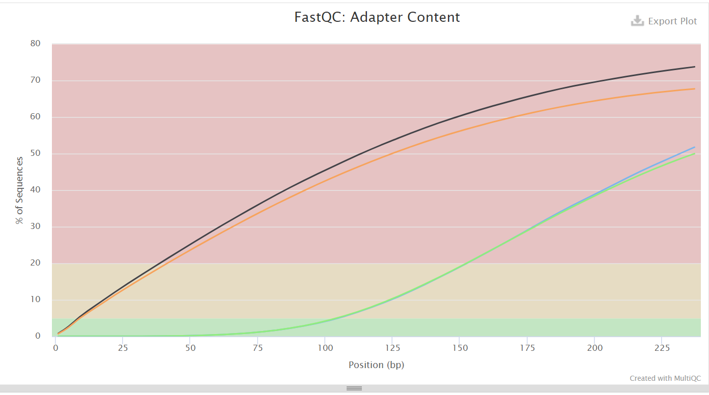
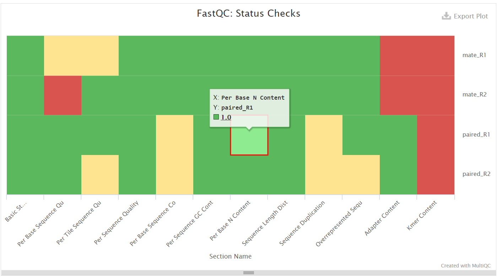

# hse21_hw1
## Команды выполненные на сервере
1. Создание символических ссылок на файлы с исходными последовательностями
```
mkdir init_data
cd init_data
 ls /usr/share/data-minor-bioinf/assembly/* | xargs -tI{} ln -s {}
```
2. Анализ загруженности сервера

3. Выбор необходимого количества чтений
```
seqtk sample -s919 oil_R1.fastq 5000000 > paired_R1.fastq
seqtk sample -s919 oil_R2.fastq 5000000 > paired_R2.fastq
seqtk sample -s919 oilMP_S4_L001_R1_001.fastq 1500000 > mate_R1.fastq
seqtk sample -s919 oilMP_S4_L001_R2_001.fastq 1500000 > mate_R2.fastq
```
Результат

4. Удаление ненужных ссылок, анализ fastqc и объединение с помощью multiqc
```
rm oil*
mkdir fastqc
ls | xargs -P 4 -tI{} fastqc -o fastqc{}
multiqc -o multiqc fastqc
```
5. Обрезание чтений с помощью platanus
```
platanus_trim paired_R1.fastq paired_R2.fastq 
platanus_internal_trim mate_R1.fastq mate_R2.fastq
```
6. Анализ fastqc обрезанных файлов и объединение с помощью multiqc
```
rm -f paired_R1.fastq paired_R2.fastq mate_R1.fastq mate_R2.fastq
mkdir trimmed_fastqc
ls *trimmed | xargs -tI{} fastqc -o trimmed_fastqc {}
mkdir trimmed_multiqc
multiqc -o trimmed_multiqc trimmed_fastqc
```
7. Сборка контигов
```
platanus assemble -f paired_R1.fastq.trimmed paired_R2.fastq.trimmed 2> assemble.log
```
8. Сборка скаффолдов и выделение самого длинного (вероятного)
```
platanus scaffold -c out_contig.fa -IP1 paired_R1.fastq.trimmed paired_R2.fastq.trimmed -OP2 mate_R1.fastq.int_trimmed mate_R2.fastq.int_trimmed 2> scaffold.log
out_scaffold.fa |wc -l
head out_scaffold.fa
echo scaffold1_len3833811_cov232 > best_scaffold.txt
seqtk subseq out_scaffold.fa best_scaffold.txt > best_scaffold.fasta
```
9. Удаление гэпов из выделенного скаффолда
```
platanus gap_close -c out_scaffold.fa -IP1 paired_R1.fastq.trimmed paired_R2.fastq.trimmed -OP2 mate_R1.fastq.int_trimmed mate_R2.fastq.int_trimmed 2> best_scaffold_gap_close.log
```
## Отчеты Multiqc
### Исходные чтения




### Подрезанные чтения


## Ссылка на Google Colab
пока недоделала :)


